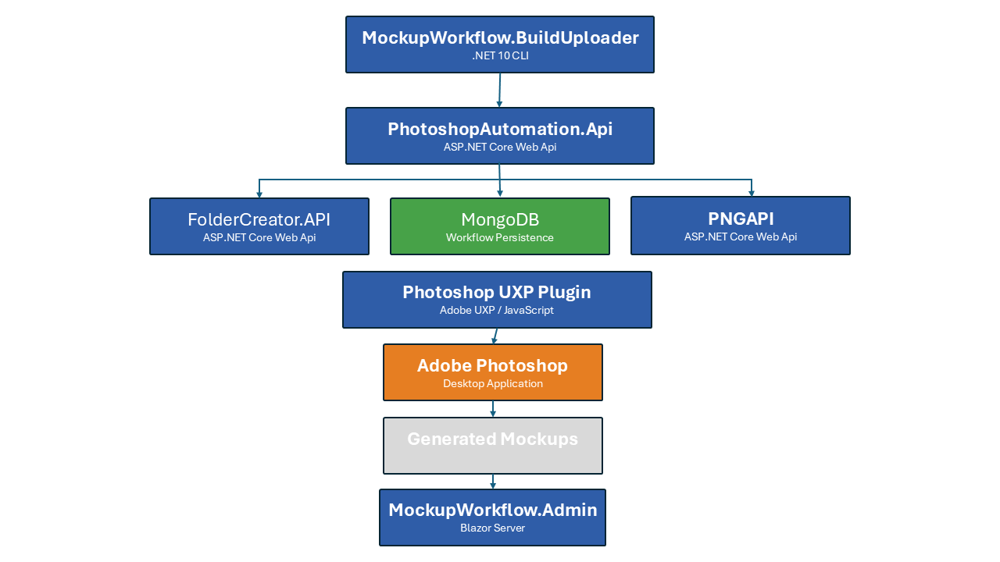

# Mockup Workflow Platform


Mockup Workflow Platform is a distributed workflow automation platform for high-volume creative production. It combines Adobe Photoshop UXP, ASP.NET Core services, MongoDB, Docker, and Blazor into configurable workflow pipelines that automate asset generation, mockup production, and digital publishing.

## Project Status

**Status:** Active Development (Portfolio Release)

The Mockup Workflow Platform is under active development and serves as the foundation for automated mockup generation and digital publishing workflows.

Current capabilities include:

- Batch workflow orchestration
- Photoshop UXP automation
- Dockerized microservices
- Administrative dashboard
- Asset management APIs
- Workflow monitoring

## Platform Architecture



## Explore the Platform

The Mockup Workflow Platform is distributed across several focused repositories. Start with the component that best matches what you want to explore.

### Start with the Architecture

This repository provides the system-level overview, architecture documentation, workflow description, and links to the individual platform components.

### Explore the Photoshop Automation

[Photoshop UXP Batch Mockup Plugin](https://github.com/swisherman/photoshop-uxp-batch-mockup-plugin)

See how the platform executes configurable Photoshop workflows, processes PSD templates, replaces artwork, generates mockups, and reports processing results.

### Explore the Workflow API

[PhotoshopAutomation.Api](https://github.com/swisherman/PhotoshopAutomation.Api)

Review the ASP.NET Core API responsible for workflow records, batch processing, queue state, completion tracking, and communication with the Photoshop plug-in.

### Explore the Operations Dashboard

[MockupWorkflow.Admin](https://github.com/swisherman/MockupWorkflow.Admin)

Explore the Blazor Server administration dashboard used to import production batches, monitor workflow execution, review processing status, and manage automated Photoshop production workflows.

Review the ASP.NET Core API responsible for workflow records, batch processing, queue state, completion tracking, and communication with the Photoshop plug-in.

### Explore Folder Preparation

[FolderCreator.API](https://github.com/swisherman/FolderCreator.API)

See how standardized batch and product folder structures are created from structured requests before creative processing begins.

### Explore Asset Uploads

[MockupWorkflow.BuildUploader](https://github.com/swisherman/MockupWorkflow.BuildUploader)

Review the .NET command-line utility used to upload prepared input and mockup folders while preserving the platform’s expected directory structure.

### Recommended Review Path

For a complete tour of the system:

1. Review the architecture diagram in this repository.
2. Explore `PhotoshopAutomation.Api` to understand workflow state and orchestration.
3. Explore `MockupWorkflow.Admin` to see how operators manage production batches and monitor workflow execution.
4. Explore the Photoshop UXP plug-in to see workflow execution inside Adobe Photoshop.
5. Review `FolderCreator.API` and `MockupWorkflow.BuildUploader` to understand asset preparation and movement.
6. Review the end-to-end workflow below to see how the components operate together.

## Overview

Mockup Workflow Platform is a modular automation platform designed around reusable workflow concepts rather than product-specific logic.

The platform separates:

- Workflow orchestration
- Photoshop automation
- Asset management
- Administrative monitoring
- Shared business models
- File management

This architecture allows multiple products and content pipelines to share the same workflow engine.

## What This Demonstrates

This project showcases experience designing and building a distributed workflow automation platform from the ground up, including:

- Distributed system architecture
- Adobe Photoshop UXP development
- ASP.NET Core Web APIs
- Blazor Server applications
- MongoDB data modeling
- Docker containerization
- Workflow engine design
- Batch processing pipelines
- Service-oriented architecture
- End-to-end production automation

## Why It Exists

Creative production often requires repeating the same Photoshop operations hundreds or thousands of times.

The Mockup Workflow Platform automates those repetitive tasks through configurable workflows, allowing new product pipelines to be added without redesigning the core system.

## Architecture 

The Mockup Workflow Platform is built around a configurable workflow engine rather than product-specific automation.

Workflows are composed of ordered processing steps executed by registered processors, allowing new products and production pipelines to be added without redesigning the core platform.

## Technology 

### Languages
- C#
- JavaScript

### Frameworks
- ASP.NET Core
- Blazor Server
- Adobe Photoshop UXP

### Infrastructure
- Docker
- MongoDB

### Architecture

- REST APIs
- Service-Oriented Architecture
- Workflow Engine

## Platform Components

| Component | Status | Technology | Responsibility |
|-----------|:------:|------------|----------------|
| **[MockupWorkflow.BuildUploader](https://github.com/swisherman/MockupWorkflow.BuildUploader)** | ✅ Public | .NET 10 CLI | Imports build assets and initializes workflow batches. |
| **[PhotoshopAutomation.Api](https://github.com/swisherman/PhotoshopAutomation.Api)** | ✅ Public | ASP.NET Core | Coordinates workflow execution, batch management, and processing state. |
| **[MockupWorkflow.Admin](https://github.com/swisherman/MockupWorkflow.Admin)** | ✅ Public | Blazor Server | Provides an administrative dashboard for monitoring workflow execution. |
| **[FolderCreator.API](https://github.com/swisherman/FolderCreator.API)** | ✅ Public | ASP.NET Core | Creates standardized input and output folder structures. |
| PNGAPI *(public repository coming soon)* | 🚧 Coming Soon | ASP.NET Core | Stores and serves generated workflow assets through REST APIs. |
| **[photoshop-uxp-batch-mockup-plugin](https://github.com/swisherman/photoshop-uxp-batch-mockup-plugin)** | ✅ Public | Adobe Photoshop UXP | Executes Photoshop workflow steps and generates production mockups. |
| MockupWorkflow.Shared *(public repository coming soon)* | 🚧 Coming Soon | .NET Class Library | Provides shared domain models, contracts, and common libraries. |
---

## Repository Ecosystem

The Mockup Workflow Platform is implemented across several focused repositories. Each repository owns one part of the workflow while this repository serves as the architectural overview and navigation hub.

```text
Mockup Workflow Platform
├── photoshop-uxp-batch-mockup-plugin
├── PhotoshopAutomation.Api
├── MockupWorkflow.Admin
├── FolderCreator.API
├── PNGAPI
├── MockupWorkflow.Shared
└── MockupWorkflow.BuildUploader
```

Each repository has a single responsibility:

| Repository | Purpose |
|------------|---------|
| **MockupWorkflow.Platform** | Platform overview, architecture, documentation, and orchestration |
| **Photoshop UXP Plugin** | Adobe Photoshop UXP workflow engine |
| **PhotoshopAutomation.Api** | REST API for workflow processing |
| **MockupWorkflow.Admin** | Blazor administration dashboard |
| **FolderCreator.API** | Folder creation and file preparation service |
| **PNGAPI** | PNG storage and retrieval service |
| **MockupWorkflow.Shared** | Shared models and contracts |
| **MockupWorkflow.BuildUploader** | Build asset upload utility |

---

## Photoshop UXP Plugin

**Purpose**

Serves as the Photoshop execution engine for the platform, automating production workflows through configurable, multi-step processing pipelines.

**Responsibilities**

- Load pending workflow batches
- Execute configurable workflow steps
- Open and process Photoshop PSD templates
- Replace Smart Object contents
- Generate production-ready mockups
- Upload generated assets
- Report workflow completion and failures

**Technologies**

- Adobe Photoshop UXP
- JavaScript
- Photoshop DOM & BatchPlay APIs
- REST APIs

**Repository**

[swisherman/photoshop-uxp-batch-mockup-plugin](https://github.com/swisherman/photoshop-uxp-batch-mockup-plugin)

## PhotoshopAutomation.Api

**Purpose**

Coordinates workflow execution by managing batch processing, exposing REST endpoints, and serving as the central orchestration service between the Photoshop UXP plug-in, administration dashboard, and supporting services.

**Responsibilities**

- Register and manage workflow batches
- Expose REST API endpoints
- Coordinate workflow execution
- Manage processing state
- Queue pending work
- Report workflow completion and failures

**Technologies**

- ASP.NET Core
- REST APIs
- MongoDB
- Docker

**Repository**

[swisherman/PhotoshopAutomation.Api](https://github.com/swisherman/PhotoshopAutomation.Api)

## MockupWorkflow.Admin

**Purpose**

Provides a Blazor-based administration dashboard for monitoring, managing, and troubleshooting workflow execution across the Mockup Workflow Platform.

**Responsibilities**

- Monitor workflow batches in real time
- View batch and processing status
- Track completed, pending, and failed jobs
- Display workflow progress and processing metrics
- Review processing errors and diagnostics
- Support operational management of production workflows

**Technologies**

- ASP.NET Core
- Blazor Server
- MudBlazor
- MongoDB
- Docker

**Repository**

[swisherman/MockupWorkflow.Admin](https://github.com/swisherman/MockupWorkflow.Admin)

## FolderCreator.API

**Purpose**

Prepares the file system structure required for each workflow batch by creating standardized input and output directories before Photoshop processing begins.

**Responsibilities**

- Create workflow batch folder structures
- Prepare input and output directories
- Organize assets by batch and product type
- Validate folder layouts
- Support automated workflow initialization

**Technologies**

- ASP.NET Core
- REST API
- Docker

**Repository**

[swisherman/FolderCreator.API](https://github.com/swisherman/FolderCreator.API)

## PNGAPI

**Purpose**

Provides centralized storage and retrieval of workflow assets, enabling generated mockups and supporting files to be uploaded, organized, and accessed consistently across the platform.

**Responsibilities**

- Upload generated workflow assets
- Retrieve images and supporting files
- Organize assets by batch and product type
- Provide REST endpoints for asset management
- Support integration between workflow services

**Technologies**

- ASP.NET Core
- REST API
- Docker

**Repository**

> *Public repository coming soon.*

## MockupWorkflow.Shared

**Purpose**

Provides shared models, contracts, and common libraries used across the Mockup Workflow Platform to ensure consistency between services.

**Responsibilities**

- Define shared data models
- Maintain common DTOs and contracts
- Provide reusable utility classes
- Standardize communication between services
- Reduce duplicated code across repositories

**Technologies**

- .NET 10
- C#
- Shared Class Library

**Repository**

> *Public repository coming soon.*

## MockupWorkflow.BuildUploader

**Purpose**

Provides a command-line utility for preparing and uploading workflow assets into the platform while preserving the expected batch and product directory structure.

**Responsibilities**

- Upload input folders
- Upload mockup folders
- Preserve batch directory structures
- Support workflow initialization
- Integrate with PNGAPI

**Technologies**

- .NET 10
- C#
- Command-Line Interface (CLI)
- REST API

**Repository**

[swisherman/MockupWorkflow.BuildUploader](https://github.com/swisherman/MockupWorkflow.BuildUploader)

## Workflow

The Mockup Workflow Platform automates creative production through a configurable, multi-stage processing pipeline. Each component has a well-defined responsibility, allowing the platform to scale as new product types and workflow steps are added.

### End-to-End Workflow

```text
Source Artwork
        |
        v
MockupWorkflow.BuildUploader
        |
        v
PhotoshopAutomation.Api
        |
        v
MongoDB Workflow Queue
        |
        v
Photoshop UXP Plugin
        |
        v
Workflow Engine
        |
        +--> Step 10 - Artwork Generation
        |
        +--> Step 20 - Mockup Generation
        |
        +--> Future Workflow Steps...
        |
        v
Generated Mockups
        |
        v
PNGAPI
        |
        v
MockupWorkflow.Admin
```

### Workflow Summary

1. **BuildUploader** prepares and uploads production assets.
2. **PhotoshopAutomation.Api** registers workflow batches and exposes REST endpoints.
3. **MongoDB** stores workflow definitions, batch status, and processing state.
4. **Photoshop UXP Plugin** retrieves pending batches and executes the workflow.
5. **Workflow Engine** processes each configured workflow step in sequence.
6. **PNGAPI** stores the generated mockups.
7. **MockupWorkflow.Admin** provides real-time monitoring and batch management.

## Design Principles

- Modular services
- Workflow-driven architecture
- Product-independent processing
- Shared domain models
- Docker-based deployment
- Extensible processor pipeline

## Roadmap

### Near Term

- Additional workflow processors
- Workflow configuration editor
- Additional product pipelines
- Public release of additional platform components

### Future

- Cloud storage providers
- Marketplace publishing integration
- Distributed worker processing
- Workflow designer and visual editor
- Additional creative production pipelines

## Example Consumers

The platform is designed to support multiple applications.

Current consumer:

- Mosswick.World

Future consumers may include:

- Additional digital art publishing systems
- Marketplace automation tools
- Product generation pipelines

## Key Features

- Configurable multi-step workflow engine
- Photoshop UXP automation
- Dockerized microservice architecture
- REST-based service communication
- MongoDB-backed workflow persistence
- Blazor administrative dashboard
- Batch processing and monitoring
- Shared domain model across services

## Repository Purpose

This repository serves as the architectural overview of the Mockup Workflow Platform.

Individual repositories contain the implementation of each service, while this repository documents how they integrate into a scalable workflow automation platform for creative production and digital publishing.

